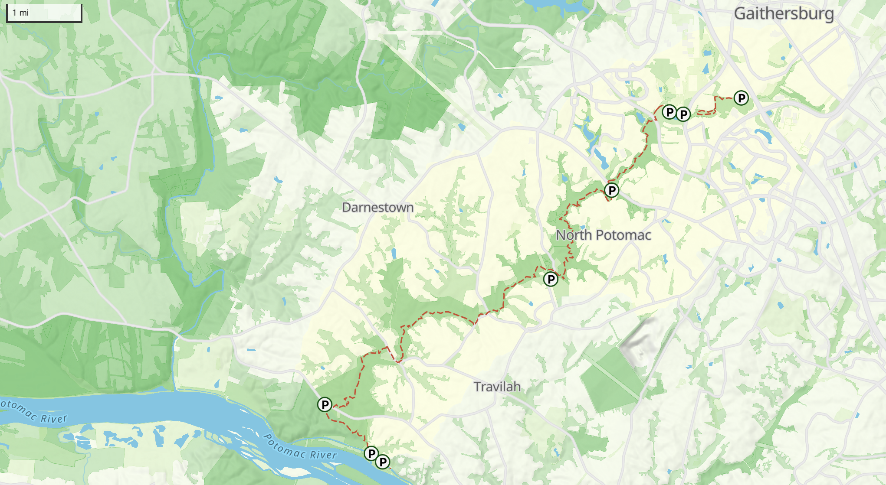

Welcome! This repo contains a redesigned web map of the [Muddy Branch Greenway Trail](https://muddybranch.org/maps/), suitable for embedding in an iFrame or wherever you might need a digital map. The map is rendered by [Maplibre GL JS](https://maplibre.org/maplibre-gl-js/docs/). There are no additional external requirements or dependencies.



- Click [here](https://mizmay.github.io/muddy_branch_maps/) for an interactive version of the map.
- Click [here](https://mizmay.github.io/muddy_branch_maps/muddy_branch_trail.html) for a preview of how this map is intended to look when embedded in the Muddy Branch Alliance website.

Here is a brief explanation of all of the underlying components this map relies on to render and display an intereactive map.

## Deployment

If you are interested in deploying (or modifying) this map from your own account:

1. Clone this repo
3. Enable Github Pages in the new location
4. Search and replace any hard-coded references to the original Github Pages hosting site (e.g. https://mizmay.github.io/) with the new domain

## Data from OpenStreetMap

The trail geometry, along with associated parking lots, trailheads, and other waypoints are all associated [with a single route relation in OpenStreetMap](https://www.openstreetmap.org/relation/18728360). To update any of those features on this map:
1. Create an account (if you don't have one already), log in, and [edit the geometries or tags via OpenStreetMap](https://www.openstreetmap.org/relation/18728360)
2. Once you are satisfied with your updates, follow the instructions below to export the whole route relation as a GeoJSON and replace the GeoJSON in this file.

Once updated, your changes will show up on the Muddy Branch Trail map automatically.

### Exporting the Muddy Branch Greenway Trail Relation

1. Go to [Overpass Turbo](https://overpass-turbo.eu/#) and paste in this query to select the trail rail, parking polygons, and points of interest:
```
/* Muddy Branch Greenway Trail */
[out:json][timeout:25];

// Store the relation
rel(18728360)->.rel;

// Get member ways and their nodes
(
  way(r.rel);
  node(w); // nodes of the ways
)->.ways_and_nodes;

// Get member nodes that are *direct* members of the relation
node(r.rel)->.standalone_nodes;

// Combine all
(
  .ways_and_nodes;
  .standalone_nodes;
);
out body;
```

2. Hit download, select GeoJSON, and save to your local drive.

### Replacing the data in this Repo

1. ( Optional / Recommended ) Verify the updates in the GeoJSON make sense compared with `muddy_branch_relation.geojson`.
2. Replace `muddy_branch_relation.geojson` with the file you just downloaded.

## Icons and Fonts

All the map icons and text labels are rendered from assets in this repo. Instructions for how to access or modify these below.

The original Protomaps assets were helpful in defining what to implement and how, documented [here](https://github.com/protomaps/basemaps-assets?tab=readme-ov-file).

### Icons

Icons are [custom SVGs](./assets/icons) created for this project and transformed to [sprites](https://github.com/mizmay/muddy_branch_maps/tree/main/assets/sprites) that match the Maplibre GL spec using a command-line tool called [Spreet](https://github.com/flother/spreet). Note, both the JSON and PNG are required by the renderer.

### Fonts

The map currently uses [Noto Sans](https://fonts.google.com/noto/specimen/Noto+Sans) for all text labels, accessed from [here](./assets/fonts). You can switch to any [Maplibre GL compatible font](https://github.com/maplibre/font-maker) by updating the `text-font` declarations [throughout the stylesheet](./assets/Muddy_Branch_Greenway_Trail_Map/style.json) and the stylesheet `glyph` [location](./assets/Muddy_Branch_Greenway_Trail_Map/style.json#L27) (if stored somewhere else). 

## Reference Layers


The _reference layers_ are everything on the map _not_ coming directly from the OpenStreetMap query above.

### Hillshade

The shaded terrain (hillshade) effect was created from the stylesheet based on [custom terrain tiles](assets/Muddy_Branch_Greenway_Trail_Map/terrarium-extract-z12.pmtiles) generated by downloading [a PMTiles archive of zoom 12 terrain tiles](https://docs.protomaps.com/basemaps/downloads#terrain) and clipping the extent via:
```
pmtiles extract terrarium-z12.pmtiles muddy_branch_area.pmtiles --bbox=-77.574463,38.934310,-76.956482,39.254056
```
The original source for this archive is [here](https://registry.opendata.aws/terrain-tiles/). There is a lot more information about the Terrarium tiles, created by Tilezen [here](https://github.com/tilezen/joerd).

Note this terrain data is likely from 2008 or before, and at current writing there is nothing newer available from the [USGS National Map](https://apps.nationalmap.gov/downloader/). However there is a more recent digital elevation model (DEM) available from the Montgomery County GIS website [here](https://data.imap.maryland.gov/datasets/474bb0b3df484e979a390f39ba4cc47d/explore). If you choose to update to this data source, download this DEM, warp it to the correct map projection (Web Mercator, EPSG:3857), and then are two options for replacing current hillshade layer with this one:
1. Convert it to [RGB-encoded](https://github.com/mapbox/rio-rgbify) PMtiles, replace the existing file, and update the `hillshade` layer of the stylesheet as needed, OR
2. Use [QGIS](https://docs.qgis.org/3.40/en/docs/training_manual/rasters/terrain_analysis.html) or [GDAL](https://gdal.org/en/stable/programs/gdaldem.html) to generate a pre-styled hillshade, convert it to PMtiles, replace the existing file, and change the stylesheet to reflect that the new data source is type `raster-dem`, rendered as-is.

### Landcover, Roads, Labels, etc.

Everything else was downloaded from [Protomaps](https://docs.protomaps.com) and saved as `muddy_branch_area.pmtiles`. 

Should the data in these layers ever become out-of-date and you need a more recent version, here's how to download and replace these layers:
1. Follow the [Getting Started](https://docs.protomaps.com/guide/getting-started) guide to install the CLI and find the latest daily planet file
2. Paste this at the command line, replacing <LATEST_PLANET_FILE> with the name of the latest daily planet file:
```
pmtiles extract https://build.protomaps.com/<LATEST_PLANET_FILE>.pmtiles muddy_branch_area.pmtiles --minzoom=10 --maxzoom=16 --bbox=-77.574463,38.934310,-76.956482,39.254056
```
3. Replace the existing file in this repo with the updated file.


